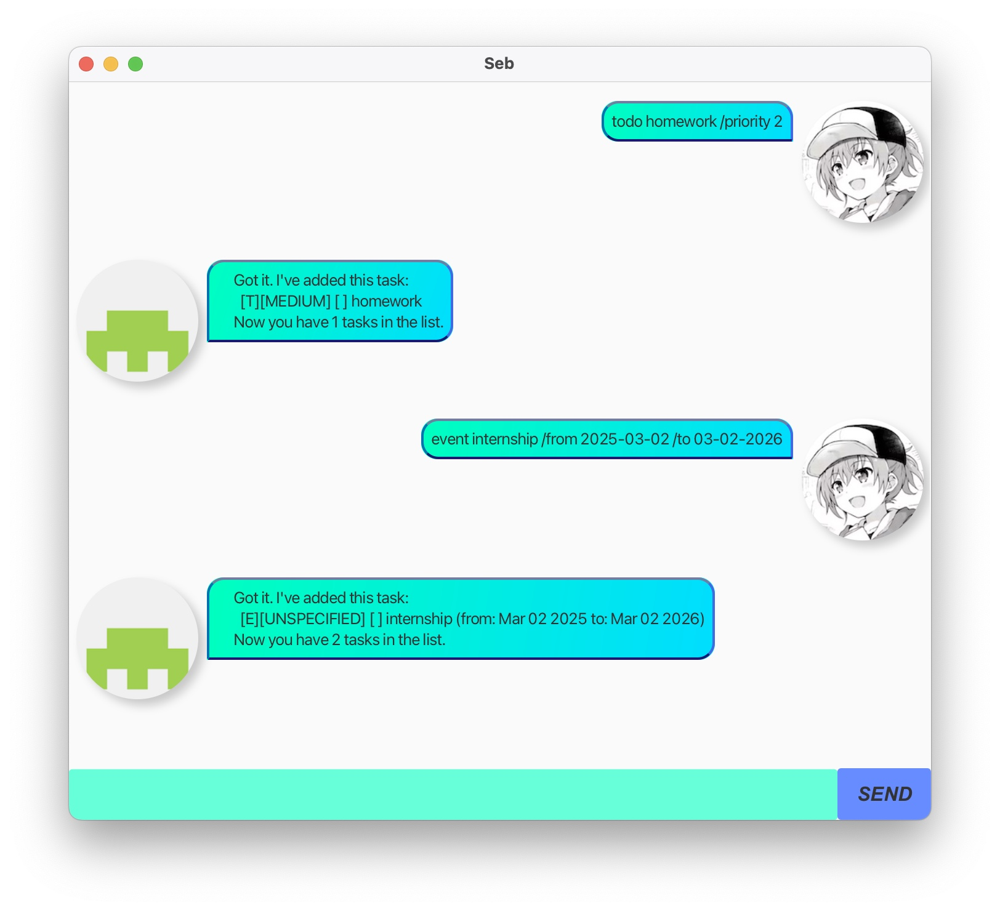

# Seb: A Task Management Bot

### User Guide
[Github Page](https://fisherskyi.github.io/ip/)

### Ui Image


### Testing GitHub Pages site locally with Jekyll
1. Ensure you have Ruby and Jekyll installed on your machine. Follow the [Jekyll installation guide](https://jekyllrb.com/docs/installation/) if needed.
2. run the following command in the *root* directory of the project:
   ```bash
   bundle install
   bundle exec jekyll serve --source docs
   ```
3. Open your web browser and navigate to `http://localhost:4000` to view
---
current bugs:
 - [X] task add without priority causes error
 - [X] set priority of existing task